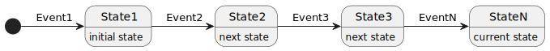
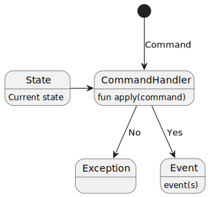
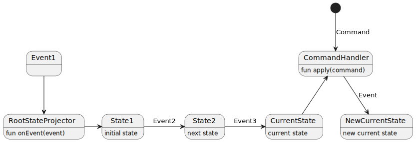
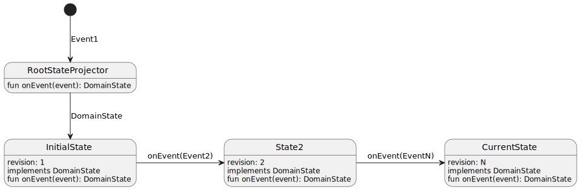

# SBAB event-store library

The `spring-boot-event-store` module is a production-grade event sourcing library for Spring Boot applications.
It’s licensed under the Apache 2.0 License.

This repository also contains a small set of demo services that show how to structure an event-sourced system end-to-end
(command side, query side, stream processing, and a BFF).

---

## Table of contents

- [What this library provides](#what-this-library-provides)
- [Event Sourcing fundamentals](#event-sourcing-fundamentals)
  - [Key concepts](#key-concepts)
  - [Commands, events, and aggregates](#commands-events-and-aggregates)
  - [State reconstruction (projection)](#state-reconstruction-projection)
  - [Optimistic concurrency](#optimistic-concurrency)
  - [Schema evolution and upcasting](#schema-evolution-and-upcasting)
- [Spring integration](#spring-integration)
- [Configuration](#configuration)
- [Demo application modules](#demo-application-modules)
- [BFF (eventual consistency gateway)](#bff-eventual-consistency-gateway)
- [Local Kafka](#local-kafka)
- [View events on Kafka using Kafbat UI](#view-events-on-kafka-using-kafbat-ui)

---

## What this library provides

At a high level, the library helps you build event-sourced domain models in Spring Boot by providing:

- **An event store** backed by a relational database (Liquibase changelog included).
- **A command execution API** (`CommandService.apply` / `CommandService.applyList`) that:
  - loads the current aggregate state by replaying events,
  - executes your domain logic (command handler),
  - persists the resulting event(s) atomically.
- **Concurrency handling** via a unique `(aggregate_id, revision)` constraint and automatic retries.
- **Event publication** to Spring’s `ApplicationEventPublisher` after successful persistence.
- **Kafka/Schema Registry friendly event payloads** using Avro, enabling robust schema evolution.

### Benefits you get by using this library

Compared to implementing event sourcing from scratch, this library aims to reduce accidental complexity by giving you:

- **A consistent execution model** for commands → events → persistence → publication.
- **Safer concurrency** with deterministic revisioning and retry semantics.
- **Better operability** through the ability to read events as JSON, plus consistent headers (`aggregate-id`, `revision`).
- **Schema evolution support** through Avro + Schema Registry and automatic upcasting when event schemas change.
- **An opinionated, production-oriented baseline** (database schema, retries, Spring integration) that still allows you to
  plug in custom behavior where needed.

---

## Event Sourcing fundamentals

Event Sourcing is an architectural pattern where all changes to an aggregate’s state are captured as an ordered stream of
immutable events. The event stream is the system of record; the latest state is derived by replaying events.



### Key concepts

- **Event**: A fact that something happened in the past. Events are immutable.
- **Aggregate**: A consistency boundary in the domain (e.g., an Account). Each aggregate has its own event stream.
- **Command**: An intent to perform an action (e.g., Deposit money). Commands are validated against current state.
- **Projection / State**: A derived view of state built by replaying events.
- **Revision**: A monotonically increasing number per aggregate that represents event order and enables optimistic
  concurrency.

### Commands, events, and aggregates

Business logic is modeled as command handling that produces one or more events:

1. A command is sent to the system.
2. A command handler evaluates the command against current aggregate state + business rules.
3. If invalid, an exception is thrown.
4. If accepted, the handler emits zero, one, or more events.



Combining state reconstruction and command handling gives the complete model:

1. Derive current state from all historical events.
2. Apply a command based on that state to produce new events.



#### First command for a new aggregate

The first command for a new aggregate is evaluated against an empty (`null`) state because no events exist yet.

### State reconstruction (projection)

This library models state reconstruction explicitly:

- A `RootStateProjector` creates the initial `DomainState` instance given the **first event**.
- The `DomainState` instance then handles subsequent events sequentially via `onEvent` until it represents the current
  state.



#### Reflective `RootStateProjector`

The library includes a reflective `RootStateProjector` implementation:

- It scans classes implementing `DomainState`.
- It chooses a constructor that takes exactly one `Event` parameter.
- The constructor is used to create the initial state from the first event.

To specify the root package of your domain events, set the Spring property `events-domain-package`.

If you need more control (multiple aggregate types, non-standard initialization, etc.), you can implement your own
`RootStateProjector`.

#### Command execution API

Use `CommandService.apply` when exactly one event should be created, or `CommandService.applyList` when the command may
produce zero to many events.

A command handler is typically implemented as a function/class that takes the current state and returns event(s). For
example:

```kotlin
class DepositMoneyCommandHandler(private val account: Account?) {
   fun handle(command: DepositMoneyCommand): MoneyDepositedEvent {
      checkNotNull(account) { "Account not found" }
      require(command.depositAmount > 0) { "Amount to deposit cannot be zero or negative" }
      return MoneyDepositedEvent(command.accountId, command.depositAmount)
   }
}
```

And executed like this:

```kotlin
@Operation(summary = "Deposit money to an account")
@PutMapping("/{accountId}/deposit")
fun depositMoneyToAccount(
   @Schema(example = "b4e37836-049b-40d3-b872-330d863fc2b9", required = true)
   @PathVariable("accountId") accountId: AccountId,
   @RequestBody request: DepositMoneyRequest
) {
   val command = request.toCommand(accountId)
   commandService.apply(command.accountId) { account -> DepositMoneyCommandHandler(account).handle(command) }
}
```

### Optimistic concurrency

Event-sourced systems commonly use optimistic concurrency per aggregate.
This library uses a unique database constraint (`aggregate_unique_constraint`) on `(aggregate_id, revision)`.

If two commands try to write the same next revision concurrently:

- one transaction succeeds,
- the other fails on the constraint,
- the library retries the failed command,
- the retried command is evaluated against the new state that includes the concurrently written event(s).

This keeps the aggregate consistent without global locks.

### Schema evolution and upcasting

All events used by this library should be encoded as **Avro** and registered in **Schema Registry**.
With Avro + Schema Registry you can:

- evolve event schemas using compatibility rules,
- deserialize older events with newer code,
- (when configured) automatically upcast from older schema versions.

When used correctly, all events should be serializable/deserializable to/from the event store while supporting automatic
upcasting when events are updated.

---

## Spring integration

When an event is successfully saved to the event store, both:

- the event payload, and
- the full `EventEntity`

are published via Spring’s `ApplicationEventPublisher`.

You can handle these using `@TransactionalEventListener`.

### Publishing to Kafka in local development

For local development using an in-memory H2 database, you can use the `dev` profile to publish events to Kafka by
setting:

- `publish-events: true`

Event listeners are commonly used to:

- start/stop BPMN processes,
- publish messages to Kafka or other brokers,
- integrate with external systems.

### HTTP response headers

In a Servlet-based environment (not WebFlux), the library sets the HTTP headers:

- `aggregate-id`
- `revision`

The `revision` value is the highest revision number persisted within the current transaction.

### Read events as JSON

Use `EventsService.getEvents()` to read all events from the event store in JSON format.

### Publishing Oracle events via Kafka Connect

If events written to the central Oracle database should be published to Kafka, use a Kafka Connect connector as in the
[account-events.json](spring-boot-event-store%2Fsrc%2Ftest%2Fresources%2Fhttprequests%2Fconnectors%2Faccount-events.json) example.

---

## Configuration

This library is based on Spring. To use it:

- Import this library as a Maven dependency
- Annotate the Spring main class with `@Import(EventsourcingConfiguration::class)`
- Create a Spring bean that implements the `RootStateProjector` interface
- Create one or more domain state classes that implement the `DomainState` interface
- Include `eventsourcing-changelog.yaml` in your Liquibase changelog:

```yaml
databaseChangeLog:
  - include:
      file: classpath:/se/sbab/credit/eventsourcing/db/liquibase/eventsourcing-changelog.yaml
```

**NOTE**: Some versions of Liquibase have problems referring to a relative file included on the Java classpath.
This functionality has been tested using `liquibase-core` version `4.22.0`.

### Schema Registry configuration

Add Schema Registry configuration to your Spring `application.yml`:

```yaml
spring:
  kafka:
    properties:
      schema:
        registry:
          url: http://localhost:8081
      auto.register.schemas: true
events-payload-topic: account-events
```

- `events-payload-topic` is the Kafka topic used by the Avro serializer to find the Subject when using
  [`TopicRecordNameStrategy`](https://docs.confluent.io/current/schema-registry/serdes-develop/index.html#overview).
- Use `publish-events: true` to publish events to Kafka when using the `dev` profile (without Kafka Connect).

**NOTE**: The example above is intended for local development.
Outside local development environments, `auto.register.schemas` should typically be `false` and schema registration should
be part of your controlled deployment process.

Recommended Schema Registry settings:

- strategy: `TopicRecordNameStrategy`
- compatibility: `BACKWARD_TRANSITIVE`

Using `TopicRecordNameStrategy` allows multiple event types on the same topic.
`BACKWARD_TRANSITIVE` ensures all previously stored events can be read by the latest version of the event JAR.

It is also possible to use an in-memory mock Schema Registry for local testing:
`schema.registry.url=mock://localhost:8081`.

### Batch inserts

If a command handler returns multiple events, configure Hibernate batch inserts:

```yaml
spring:
  jpa:
    properties:
      hibernate:
        jdbc:
          batch_size: 20
```

The batch size should match the maximum number of events returned by a single command handler.

To validate batch inserts during development, you can enable statistics:

```yaml
spring:
  jpa:
    properties:
      hibernate:
        generate_statistics: true
```

More information about batch inserts:
https://www.baeldung.com/spring-data-jpa-batch-inserts

### Oracle notes (`RAW` UUID mapping)

When using an **Oracle** database, the `aggregate_id` column is mapped to a `RAW` type.
The helper functions `uuid_to_raw` and `raw_to_uuid` added by this library can be used to mitigate this:

```sql
SELECT ID, raw_to_uuid(AGGREGATE_ID) AS AGGREGATE_ID, REVISION, OCCURRED_AT, PAYLOAD
FROM EVENTS
WHERE AGGREGATE_ID = uuid_to_raw('b4e37836-049b-40d3-b872-330d863fc2b9');
```

This library also creates a database view named `EVENTS_VIEW`:

```sql
SELECT *
FROM EVENTS_VIEW
WHERE AGGREGATE_ID = 'b4e37836-049b-40d3-b872-330d863fc2b9';
```

Result:

|  ID | AGGREGATE_ID                       | REVISION | OCCURRED_AT                 | SCHEMA_ID | PAYLOAD    |
|----:|------------------------------------|---------:|-----------------------------|----------:|:----------:|
|   1 |b4e37836-049b-40d3-b872-330d863fc2b9|        1 |2023-02-21 12:01:33,011803000|         1 |   (BLOB)   |
|   2 |b4e37836-049b-40d3-b872-330d863fc2b9|        2 |2023-02-21 12:01:33,097938000|         2 |   (BLOB)   |

Note that `EVENTS_VIEW.AGGREGATE_ID` is a `VARCHAR2` column and cannot use the unique index based on the `RAW`
`AGGREGATE_ID` and `REVISION`.
This may reduce performance for some queries that filter by `AGGREGATE_ID`.

---

## Demo application modules

The `spring-boot-event-store` module is the deployable and reusable part of a multi-module build.
The other modules are libraries/services that demonstrate how to structure and run a complete example of an
event-driven architecture.

---

## BFF (eventual consistency gateway)

The `account-bff` service demonstrates how the `revision` header can be used to manage eventual consistency between the
write side (`account-command-service`) and the read side (`account-query-service`).

When you deposit money into an account, the request is routed to the write side.
The `account-bff` translates the `revision` response header into a `poll-url` header.
Clients can poll until the read side has processed events up to (at least) that revision.

Example:

```
curl -i -X 'PUT' \
  'http://localhost:8888/account-bff/api/v1/command/accounts/0112d278-19d2-483f-9f0c-4658bbcedae0/deposit' \
  -H 'accept: */*' \
  -H 'Content-Type: application/json' \
  -d '{
  "amount": 100
}'
HTTP/1.1 204 No Content
aggregate-id: 0112d278-19d2-483f-9f0c-4658bbcedae0
revision: 7
Date: Thu, 29 Jan 2026 13:26:48 GMT
poll-url: /api/v1/accounts/0112d278-19d2-483f-9f0c-4658bbcedae0/revision/7
```

Poll until the read model is up-to-date:

```
curl -i -X 'GET' \
  'http://localhost:8888/account-bff/api/v1/accounts/0112d278-19d2-483f-9f0c-4658bbcedae0/revision/7' \
  -H 'accept: */*' \
  -H 'Content-Type: application/json' \
  -d '{
  "amount": 100
}'
HTTP/1.1 200 OK
Content-Length: 0
Date: Thu, 29 Jan 2026 13:30:22 GMT
```

A `200` response means the read model is up-to-date with at least revision `7` for aggregate ID
`0112d278-19d2-483f-9f0c-4658bbcedae0`.

To more easily observe eventual consistency, request a higher revision:

```
curl -i -X 'GET' \
  'http://localhost:8888/account-bff/api/v1/accounts/0112d278-19d2-483f-9f0c-4658bbcedae0/revision/8' \
  -H 'accept: */*' \
  -H 'Content-Type: application/json' \
  -d '{
  "amount": 100
}'
HTTP/1.1 204 No Content
Date: Thu, 29 Jan 2026 13:33:49 GMT
```

Here, `204` indicates that revision `8` has not yet arrived over Kafka to the read side.

**NOTE**: This library has been tested with Kotlin and Java.

---

## Local Kafka

Use the official Docker Compose configuration
[cp-all-in-one](https://github.com/confluentinc/cp-all-in-one/blob/v7.7.1/cp-all-in-one/docker-compose.yml)
to start a local Kafka cluster.

---

## View events on Kafka using Kafbat UI

Download and install [Kafbat UI](https://github.com/kafbat/kafka-ui) to view events published to Kafka.
