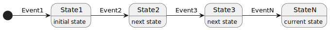
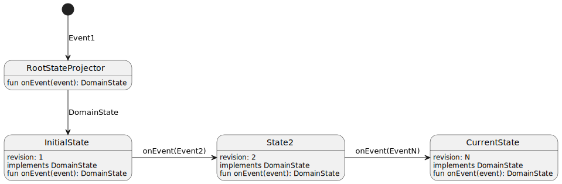

# SBAB event-store library

The `spring-boot-event-store` module is a production-grade event sourcing library that can be used in any Spring Boot
application. It is licensed under the Apache 2.0 License.

## Event Sourcing
Event Sourcing is a powerful architectural pattern that records all changes made to an application’s state in the
sequence in which those changes were originally applied. This sequence serves as both the system of record (from which
the current state can be derived) and an audit log of everything that happened within the application over its lifetime.

The basic principle works by modelling the current state as a series of events:



The current state is reached by sequentially processing all events, starting from the first event and proceeding to the
last. Business logic is implemented using commands, which follow these logical steps:

1. When an action needs to be performed that will update (mutate) the data managed by the system, a command is sent to
   the system.
2. The command is then passed to a command handler.
3. The command handler checks whether the command can be applied, considering the current state of the aggregate and the
   business rules of the domain.
4. If the command cannot be applied to the given state, an exception is thrown.
5. If the command is accepted, the command handler may return zero, one, or more events. These events represent the
   state changes caused by the command.


The complete model can be described by combining the following two steps:
1. Derive the current state, given all the events that have happened so far.
2. Apply a command based on the current state to generate one or more new events.


Note that the very first command for a new aggregate will be given an empty (`null`) state as an argument. This is the
case when no previous events exist for the given aggregate when a command should be applied.

This library supports this by passing the first event (named `Event1` in the image above) to the
`RootStateProjector.onEvent` method. This method returns a class that implements the `DomainState` interface and is
capable of updating the state one event at a time until the current state is reached:



The Spring bean implementing the `RootStateProjector` interface takes an event (the first in the event stream) as an
argument and returns an initial state in the form of a class that implements the `DomainState` interface.

This library features a reflective `RootStateProjector` implementation. It identifies all constructors with a single
`Event` parameter within classes that implement the `DomainState` interface and uses the first one it discovers.
To specify the root package of the domain events, set the `events-domain-package` property in Spring.
You can also implement your own `RootStateProjector` if you need more control over the process.

A `DomainState` class must implement the `onEvent` method, which is responsible for handling each event.

`CommandService.apply` and `CommandService.applyList` are then used to execute commands on the current state.
This is done by implementing an update function that takes the current state as input and returns an event or a list of
events. Such a function is implemented as a command handler. For example:

```kotlin
class DepositMoneyCommandHandler(private val account: Account?) {
   fun handle(command: DepositMoneyCommand): MoneyDepositedEvent {
      checkNotNull(account) { "Account not found" }
      require(command.depositAmount > 0) { "Amount to deposit cannot be zero or negative" }
      return MoneyDepositedEvent(command.accountId, command.depositAmount)
   }
}
```

The command handler can then be executed using the command service `apply` or `applyList` function:

```kotlin
@Operation(summary = "Deposit money to an account")
@PutMapping("/{accountId}/deposit")
fun depositMoneyToAccount(
   @Schema(example = "b4e37836-049b-40d3-b872-330d863fc2b9", required = true)
   @PathVariable("accountId") accountId: AccountId,
   @RequestBody request: DepositMoneyRequest
) {
   val command = request.toCommand(accountId)
   commandService.apply(command.accountId) { account -> DepositMoneyCommandHandler(account).handle(command) }
}
```

Use `apply` if exactly one event should be created, or `applyList` if zero to many events should be created by the
command.

Note that all events used by this library should use the Avro format and Schema Registry.
When used correctly, you should be able to serialize and deserialize all events to and from the event store with full
support for automatic upcasting when events are updated.

## Spring support
When an event is successfully saved to the event store, both the event and the full `EventEntity` are published to the
Spring `ApplicationEventPublisher`. This means that you can listen for events using the `@TransactionalEventListener`
annotation. For local development using an in-memory H2 database, use the `dev` profile to publish events to Kafka. This
is done by setting the following application property:
`publish-events: true`

Event listeners can typically be used to:
* Start or stop a BPMN process
* Send a Kafka message to external services

This library also sets the HTTP headers `aggregate-id` and `revision` when used in a Servlet-based environment
(not WebFlux). The revision number will be the highest number that was saved to the database in the transaction.

Use the built-in `EventsService.getEvents()` to read all events from the event store in JSON format.

If events written to the central Oracle database should be published to Kafka, use a Kafka Connect connector as in the
[account-events.json](spring-boot-event-store%2Fsrc%2Ftest%2Fresources%2Fhttprequests%2Fconnectors%2Faccount-events.json) example.

## Concurrency
This library has internal support for handling concurrent commands for the same aggregate. A unique database constraint
(`aggregate_unique_constraint`) for the `aggregate_id` and `revision` combination will prevent one of the concurrent
commands from generating events with the same revision number. Retries will then be performed for the command that failed
to write to the database. The command handler will then be given the new state that the concurrent command caused.

## Demo app
The `spring-boot-event-store` module is the deployable and reusable part of a multi-module build. All other modules are
libraries and services that demonstrate how to structure, build, and run a complete example for an event-driven
architecture.

## Configuration
This library is based on Spring. To use it, follow the steps below:

* Import this library as a Maven dependency
* Annotate the Spring main class with `@Import(EventsourcingConfiguration::class)`
* Create a Spring service/bean that implements the `RootStateProjector` interface
* Create one or more domain state classes that implement the `DomainState` interface
* Include the `eventsourcing-changelog.yaml` file in your local Liquibase changelog:
```yaml
databaseChangeLog:
  - include:
      file: classpath:/se/sbab/credit/eventsourcing/db/liquibase/eventsourcing-changelog.yaml
```
**NOTE**: Some versions of Liquibase have problems referring to a relative file included on the Java classpath. This
functionality has been tested using `liquibase-core` version `4.22.0`.
* Add the Schema Registry config to your Spring `application.yml` file:
```yaml
spring:
  kafka:
    properties:
      schema:
        registry:
          url: http://localhost:8081
      auto.register.schemas: true
events-payload-topic: account-events
```
* Add the `publish-events: true` property to `application.yml` to publish events to Kafka when using the `dev` profile in
  your local environment, without Kafka Connect.
* Configure `jdbc.batch_size` if the command handler returns more than one event:
```yaml
spring:
  jpa:
    properties:
      hibernate:
        jdbc:
          batch_size: 20
```
The batch size should match the maximum number of events returned from a single command handler.

Generate statistics to validate batch inserts using this configuration (used during development):
```yaml
spring:
  jpa:
    properties:
      hibernate:
        generate_statistics: true
```
More info regarding batch inserts can be found [here](https://www.baeldung.com/spring-data-jpa-batch-inserts).

**NOTE**: The example Schema Registry config above is for local development using a local Kafka setup.
The `auto.register.schemas` property should be set to `false` outside local development.
Registration of new events in Schema Registry should be done before usage in any shared environments.
The following Schema Registry properties should be used:

* strategy: `TopicRecordNameStrategy`
* compatibility: `BACKWARD_TRANSITIVE`

Using `TopicRecordNameStrategy` means that different event types are allowed for the same topic.

The `BACKWARD_TRANSITIVE` compatibility guarantees that all events previously saved to the event store can be read when
using the latest version of the event JAR file.

It is also possible to use an in-memory mock Schema Registry (`schema.registry.url=mock://localhost:8081`) for local testing.
The `events-payload-topic` value is the Kafka topic name that the Avro serializer will use to find the
Subject using the [`TopicRecordNameStrategy`](https://docs.confluent.io/current/schema-registry/serdes-develop/index.html#overview).

When using an **Oracle** database, the `aggregate_id` column is mapped to a `RAW` type. The helper functions `uuid_to_raw` and
`raw_to_uuid` added by this library can be used to mitigate this:
```sql
SELECT ID, raw_to_uuid(AGGREGATE_ID) AS AGGREGATE_ID, REVISION, OCCURRED_AT, PAYLOAD
FROM EVENTS
WHERE AGGREGATE_ID = uuid_to_raw('b4e37836-049b-40d3-b872-330d863fc2b9');
```
This library will also create a database view named `EVENTS_VIEW` that can be used:
```sql
SELECT *
FROM EVENTS_VIEW
WHERE AGGREGATE_ID = 'b4e37836-049b-40d3-b872-330d863fc2b9';
```
Result:

|  ID | AGGREGATE_ID                       | REVISION | OCCURRED_AT                 | SCHEMA_ID | PAYLOAD    |
|----:|------------------------------------|---------:|-----------------------------|----------:|:----------:|
|   1 |b4e37836-049b-40d3-b872-330d863fc2b9|        1 |2023-02-21 12:01:33,011803000|         1 |   (BLOB)   |
|   2 |b4e37836-049b-40d3-b872-330d863fc2b9|        2 |2023-02-21 12:01:33,097938000|         2 |   (BLOB)   |

Note that the `EVENTS_VIEW` column `AGGREGATE_ID` is of type `VARCHAR2` and cannot use the unique index based on
the `RAW` `AGGREGATE_ID` and `REVISION`.
This may lead to reduced performance for SELECT statements when searching for a particular `AGGREGATE_ID`, as in the
example above.

# BFF

The `account-bff` app demonstrates how the revision number can be used by a BFF gateway to manage eventual consistency
between the `account-command-service` (write side) and the `account-query-service` (read side) in an automated way.

If you, for instance, issue an HTTP request to deposit money into an account, the request will be routed to the
`account-command-service`. The `account-bff` translates the `revision` header from the `account-command-service` response
into a `poll-url` header that can be used to poll until the read-side response is ready to be served (i.e. by the
`account-query-service`). Example:

```
curl -i -X 'PUT' \
  'http://localhost:8888/account-bff/api/v1/command/accounts/0112d278-19d2-483f-9f0c-4658bbcedae0/deposit' \
  -H 'accept: */*' \
  -H 'Content-Type: application/json' \
  -d '{
  "amount": 100
}'
HTTP/1.1 204 No Content
aggregate-id: 0112d278-19d2-483f-9f0c-4658bbcedae0
revision: 7
Date: Thu, 29 Jan 2026 13:26:48 GMT
poll-url: /api/v1/accounts/0112d278-19d2-483f-9f0c-4658bbcedae0/revision/7
```

Now, use the poll URL to check whether the read view in the `account-query-service` is up-to-date:

```
curl -i -X 'GET' \
  'http://localhost:8888/account-bff/api/v1/accounts/0112d278-19d2-483f-9f0c-4658bbcedae0/revision/7' \
  -H 'accept: */*' \
  -H 'Content-Type: application/json' \
  -d '{
  "amount": 100
}'
HTTP/1.1 200 OK
Content-Length: 0
Date: Thu, 29 Jan 2026 13:30:22 GMT
```

A `200` response means the read model is up-to-date with at least revision `7` for aggregate ID
`0112d278-19d2-483f-9f0c-4658bbcedae0`.

This process is normally very fast, so it can be hard to observe a `204`, which indicates that the response is not yet
available. You can instead request a higher revision number to demonstrate the behavior:

```
curl -i -X 'GET' \
  'http://localhost:8888/account-bff/api/v1/accounts/0112d278-19d2-483f-9f0c-4658bbcedae0/revision/8' \
  -H 'accept: */*' \
  -H 'Content-Type: application/json' \
  -d '{
  "amount": 100
}'
HTTP/1.1 204 No Content
Date: Thu, 29 Jan 2026 13:33:49 GMT
```

Here, the `204` indicates that data for revision `8` has not yet arrived over Kafka to the read side.

Note that all requests are managed by the `account-bff` service in this case, and it knows how to connect the command-side
response and generate a correct `poll-url` header. The poll endpoint will respond with `200` once the data generated by
the command is ready to be served from the `account-query-service`.

**NOTE**: This library has been tested with Kotlin and Java.

# Local Kafka
Use the official Docker Compose configuration
[cp-all-in-one](https://github.com/confluentinc/cp-all-in-one/blob/v7.7.1/cp-all-in-one/docker-compose.yml)
to spawn a local Kafka cluster.

# Listen on Kafka topics with kcat
account-events:
```bash
kcat -b localhost:9092 -t account-events -s value=avro -r http://localhost:8081 -f "Headers: %h\n Key: %k\n Payload: %s\n\n"
```
account-query-events:
```bash
kcat -b localhost:9092 -t account-query-events -s value=avro -r http://localhost:8081 -f "Headers: %h\n Key: %k\n Payload: %s\n\n"
```
